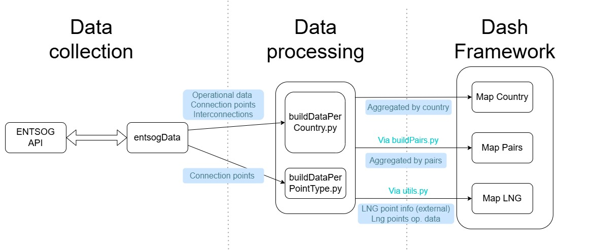

# EU Gas flow between 2019 and 2023

This repository contains the code, data, and documentation for a master's thesis analyzing the changes in natural gas flow in Europe before and after the Russian invasion of Ukraine. The project involves data collection, processing, visualization, and analysis, with the aim of providing insights into the European natural gas framework during this critical period. The data collection is based around the entsog-py module.


The dataflow and general architecture of the Software is represented in the following diagram :


## Project Structure
* data/: Contains raw and processed datasets.
* src/: Includes Python scripts for data collection, analysis, and visualization.
* notebooks/: Jupyter notebooks used for early exploration and prototyping.

## Setup Instructions

1. **Clone the Repository**
   ```sh
   git clone https://github.com/flpecheur/Thesis_EU_GasFlows.git
   ```

2. **Install Dependencies**
This code relies on the following packages : 
* entsog-py (optional, only used to run the entsogData script which's data is already present in the data directory). However, if you want to install this package you should check the entsog-py git for more precise instructions. 
* plotly
* pandas
* numpy

3. **Launch interactive setup script**
Theyre are two scripts available to reduce user interaction with the codes. For Linux or mac users, a bash script can be launched using
   ```sh
   chmod +x framework.sh
   ./framework.sh
   ```
For windows users, a Python script offers the same interactions and is launched using 
```sh
python framework.py
```
Both scripts run some prompts in the terminal to allow the user to run specific scripts by entering the number corresponding to the instruction.

3. **(OPTIONAL) Collect and build datasets**

All datasets are already loaded in the data directory which is why the data preping steps are optional.   

(OPTIONAL) Run the entsogData.py script to collect data from the ENTSOG transparency platform and store it in the data and data/opData directories.
```sh
python src/entsogData.py
```
A parameter at the start of the script can be switched if the user wants to update connection points and LNG points as well.

Combine information about LNG points
```sh
python src/buildDataPerPointType.py
```
Aggregate data per country.    
Set the desired year at the top of the file in the YEAR constant.
```sh
python src/buildDataPerCountry.py
```
(OPTIONAL) Prepare data for country interconnection pairs. Note that the map directly calls a method so running this script is not necessary for the map to work and it does not load any datasets.
```sh
python src/buildPairs.py
```
4. **Run maps**
Most map interfaces open through http://127.0.0.1:8050/ once they are launched. 

  * mapCountryTotals : Run the mapCountryTotals.py script to create maps for total entries, exits, and overall flows for each year.
  * mapLNG : Run the mapLNG_YEAR.py script to create an interactive map of LNG entry points (replace YEAR with the specific year, e.g., mapLNG_2019.py). The Dash frameworks are set to use two different ports so that both maps can be running in parallel. The 2019 map uses the same port (8050) and the 2023 map uses 8051.
  * mapPairs : Run the mapPairs.py script to display total connection flows between countries. 

## Maps descriptions
### mapCountryTotals.py: 
This script generates maps that display total entries, total exits, and overall flow for each year. Each map can be viewed by month, allowing for a detailed analysis of the flow dynamics over time. These maps provide a comprehensive overview of the flow patterns and are useful for identifying trends and anomalies in the data.

### mapCountryInterractive_YEAR.py: 
This script (where YEAR is replaced with the specific year, e.g., mapCountryInterractive_2019.py) creates an interactive map using Dash. It shows active and non-active LNG plants, and users can select a country from a dropdown menu to highlight the associated points and view the flow evolution throughout the year. Currently, it displays total entries, with plans to add graphs for total exits.

### mapPairs_FINAL.py:
This script visualizes the total connection flows between countries over a specified year. When a country is selected, the map shows the total contribution from each connected country and the flow evolution during the year. This tool helps in understanding the flow relationships and dependencies between different countries.


# Additional Notes : 
* In buildPairs.py, the DATA_DICT constant contains the final initialized dictionary. 
* In buildDataPerCountry.py, the YEAR constant should be set at the top of the file. This script aggregates data per country to display total entries/exits/flow per country. Note that some methods in this file are for visualization and may need to be checked for compatibility with recent code and data modifications.
* mapCountryTotals.py creates maps for each year's total entries, total exits, and overall flows, with the possibility to display each month. Future improvements plan to combine all three maps for each year into a single layout.
mapCountryInterractive_YEAR.py provides a Dash layout showing active and non-active LNG plants. * Selecting a country in the dropdown highlights associated points and flow evolution during the year. Currently, this only displays total entries, but graphs for total exits will be added shortly.
* mapPairs_FINAL.py displays total connection flows between countries over the year. Selecting a specific country shows total contributions per connected country and the flow evolution during the year. The YEAR parameter at the top of the file should be set accordingly. Some inconsistencies in flow direction have been found and will be investigated further, but the data is consistent.


